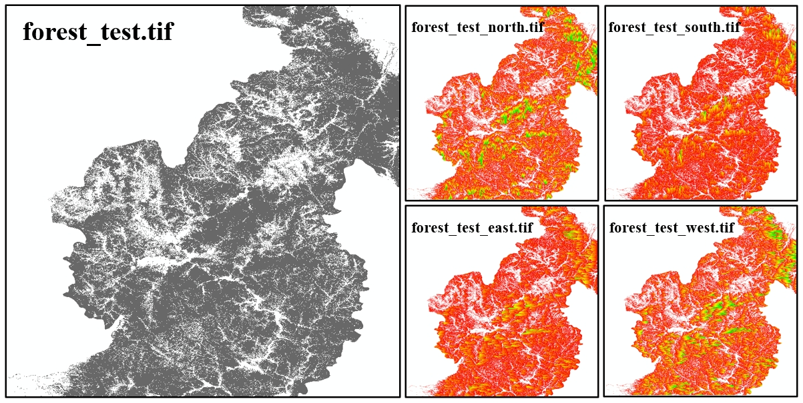
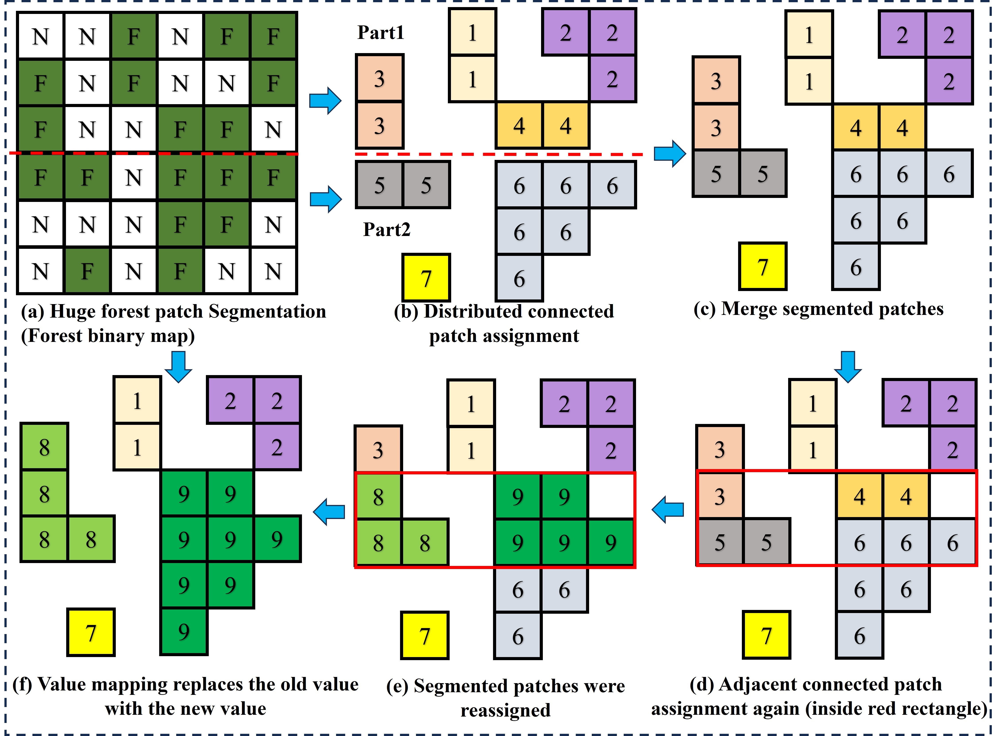
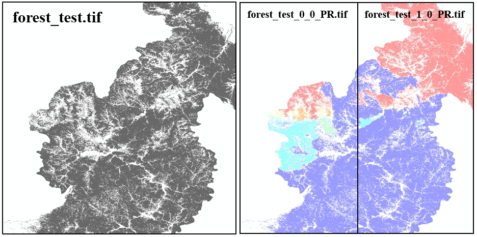

# Forest patch treatment

## **Overview**  
This project requires specific dependencies to ensure smooth execution. 
The recommended environment is managed using **Anaconda**, 
and the dependencies are listed below.  

---

## **Dependencies**  

The following libraries and versions are required for this project:  

| Library  | Version  |
|----------|---------|
| Python   | 3.9     |
| NumPy    | 1.21.5  |
| SciPy    | 1.7.3   |
| TQDM     | 4.64.1  |
| GDAL     | 3.4.0   |

---

## **How to use**

Processing large-scale forest patches requires significant computation time. 
To facilitate algorithm testing, we have provided a small-sized forest patch file `test_tif/forest_test.tif`. 
You can run `main.py` to test the algorithm and view the results directly. All output files are stored in the `test_tif` directory. Specifically, 
Method 1 generates four result files (`test_tif/*.tif`), as shown in Figure 1, 
while Method 2 produces two result files (`test_tif/clip/*_PR.tif`), as shown in Figure 3.

## **Method 1: Four-Directional Forest Boundary Detection**
This algorithm is designed for forest edge detection in binary images representing forest distributions. 
It calculates the distance of each forest pixel to the nearest boundary in four cardinal directions: 
east, south, west, and north. 
By processing the image in these four directions, 
the algorithm determines the proximity of each forest pixel to the closest edge in the respective direction. 
It systematically scans the image, identifying non-background (forest) pixels and computing their directional boundary distances. 
The results are output in a matrix format, 
enabling a comprehensive quantitative analysis of forest edge features.

**Figure 1**: Computation Results of Method 1

## **Method 2: Distributed fragment connectivity identification (DFCI)**
The Distributed Fragment Connectivity Identification (DFCI) algorithm is designed to efficiently identify and analyze forest patches across large, 
highly fragmented regions, such as Africa. In these landscapes, 
fragmentation results in numerous isolated forest patches of varying sizes, 
making large-scale processing computationally demanding. Due to memory constraints, 
directly processing binary forest maps in a single operation is infeasible. 
To overcome this challenge, DFCI employs a distributed computing approach to systematically identify and connect forest fragments. 
This algorithm enables scalable and efficient analysis of forest connectivity, 
facilitating better assessment of fragmentation patterns and ecological connectivity.

**Figure 2**: Conceptual Diagram of the DFCI Algorithm

**Figure 3**: Computation Results of the DFCI Algorithm

